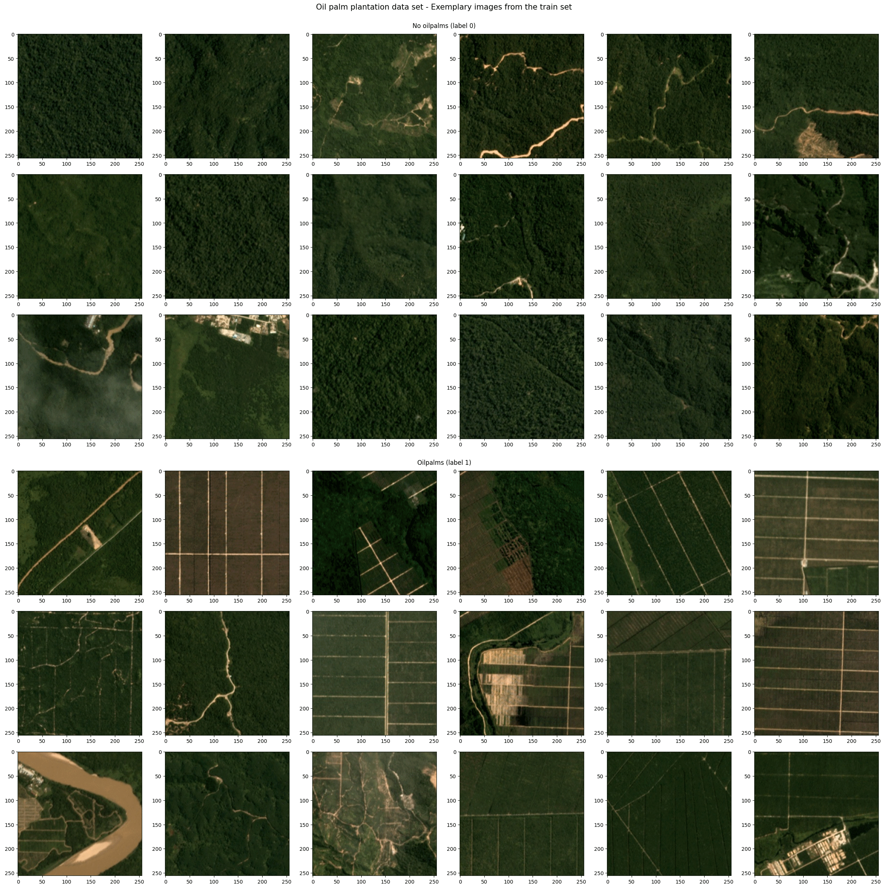

## Task & Models

Binary classification of images to decide whether they contain an oil palm plantation or not. The challenge and data set was originally launched by the [Women in Data Science (WiDS) Datathon 2019](https://www.kaggle.com/c/widsdatathon2019/data).

In this repository, the following scripts are provided to tackle this task:
* `eot_assignment_fkroeber.ipynb` -> notebook summarising the overall workflow & results
* `scripts/rf_baseline.py` -> random forest model incl. manual feature engineering
* `scripts/nn_*.py` -> cnn & vision transformer models
    * `scripts/nn_models.py` -> set of model definitions
    * `scripts/nn_train*.py` -> wrapper for training and evaluation of the models 

## Dataset description

3-meter spatial resolution satellite imagery labelled with whether an oil palm plantation appears in the image (0 for no plantation, 1 for any presence of a plantation). Some examples are shown below.

